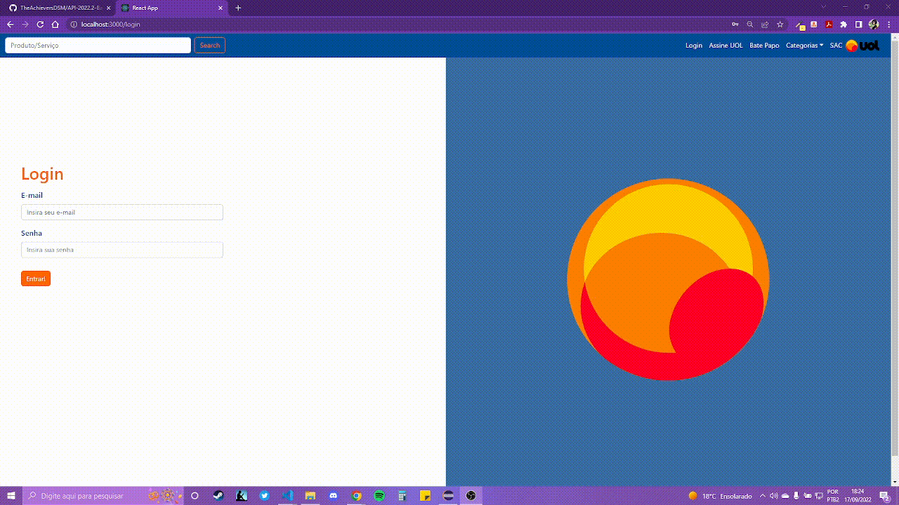
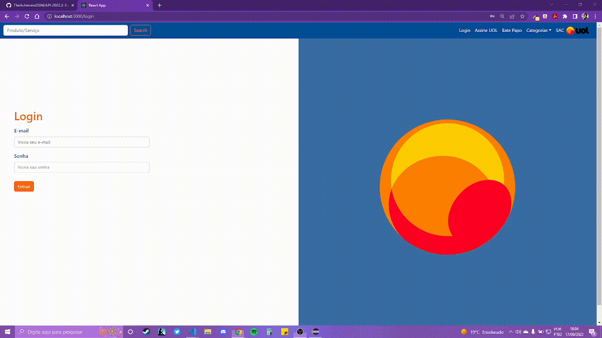

 

<h1 align="center">Sprint 1: 25/08/2022 a 18/09/2022</h1>
 

     <a href="#objetivo">Objetivo da Sprint</a> • 
     <a href="#entregas">Entregas</a> •
     <a href="#burndown">Burndown</a> 

### :bookmark_tabs: Sobre o projeto:

O projeto consiste em uma aplicação web que viabilize o cross-selling (venda cruzada) dos produtos e/ou serviços da UOL. Para isso, nesta primeira sprint,  adicionamos à aplicação a criação de: Promoções, pacotes, serviços /produtos e como MVP, as primeiras sugestões de produtos/serviços baseada no produto que está sendo visualizado pelo usuário.

  
  
 
 
 ### :dart: Objetivos da Sprint

 Os requisitos abrangidos por essa sprint são: 
     
    

 

  
  

### :dart: Entregas

   
Demonstrativos das funcionalidades aplicadas na Sprint

<h4>Cadastro de Promoções</h4>
   

<h4>Cadastro de Pacotes</h4>

   

<h4>Cadastro de Serviços</h4>
   

<h4>Cadastro de Produtos</h4>
   

<h4>Cross-selling inicial, visualização de sugestão de produtos similares/complementares</h4>

   

### :bookmark_tabs: Burndown:

   

     
<h4></h4>
 
<a href="#inicio">[Voltar ao início]</a>

> Instituição: Fatec São José dos Campos - Prof. Jessen Vidal
> 
> Curso: Desenvolvimento de Software Multiplataforma/3º Semestre
 
<a href="#inicio">[Voltar ao início]</a>
