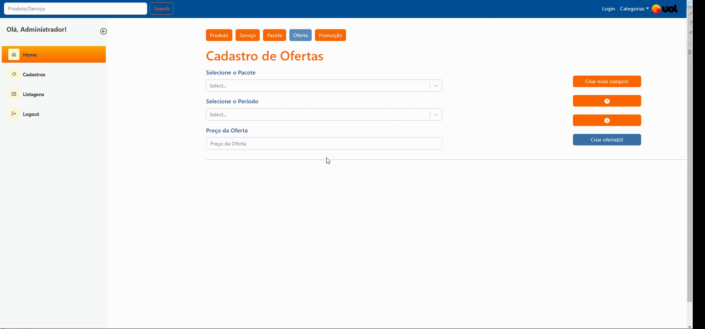
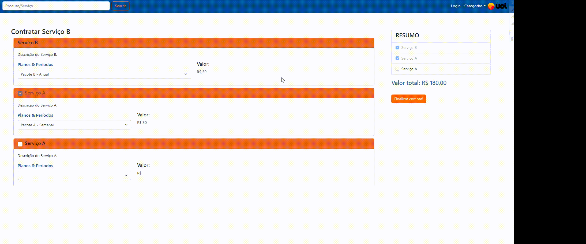

 

<h1 align="center">Sprint 3: 07/11/2022 a 27/11/2022</h1>

     <a href="#objetivo">Objetivo da Sprint</a> • 
     <a href="#entregas">Entregas</a> • 
      <a
      href="#burndown">Burndown</a>

### :bookmark_tabs: Sobre o projeto:

Nesta quarta e última sprint, focamos em entregar mais praticidade e agilidade para o administrador, tornando-o capaz de cadastrar várias ofertas de pacotes ao mesmo tempo, de forma rápida e amigável.

 
 
 ### :dart: Objetivos da Sprint

 Os requisitos abrangidos por essa sprint são: 
    

 

  
  

### :dart: Entregas

   
Demonstrativos das funcionalidades aplicadas na Sprint

<h4>Criação de múltiplas ofertas</h4>

O sistema possibilita a criação dinâmica e em massa de ofertas com vários pacotes, agilizando e tornando mais agradável a usabilidade e jornada de trabalho do administrador

<h4>Visualização do carrinho</h4>

Nesta sprint, foram realizadas também, alterações no carrinho para deixá-lo mais agradável ao possível cliente.

### :bookmark_tabs: Burndown:

   

> Instituição: Fatec São José dos Campos - Prof. Jessen Vidal
> 
> Curso: Desenvolvimento de Software Multiplataforma/3º Semestre
 
<a href="#inicio">[Voltar ao início]</a>

